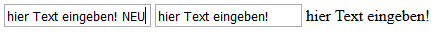
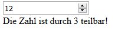

# 1 Einführung Angular

## 1.1 Was ist Angular?

- Ein TypeScript basiertes Client-Framework für dynamische Webapplikationen
- Speziell für die Entwicklung von Single-Page-Apps gedacht
- Entwickelt von Google
- Ein Open-Source-Projekt
- Eine MVC/MVVM-Framework, das uni- als auch bidirektionales Databinding unterstützt
- Auf gute Testbarkeit ausgelegt

## 1.2 Warum Client-Frameworks?

- Am Client steht viel Leistung zur Verfügung 
- Der Server liefert nur mehr die Grundstruktur der Webseite an die Clients aus
- Client bezieht über REST-Services die benötigten Daten.
- Am Client steht Software zur Verfügung, die aufgrund der Templates den DOM aufbaut und mit den Daten aus dem REST-Service füllt.
- Code Reduktion (durch Automatisierung von Standardaufgaben und Data-Binding)

**Funktionsweise:**

- Angular Appplikation wird vom Server als ganzes geladen (daher der Begriff Single-Page-App)
- Die Applikation wird dann vollständig im Browser am Client ausgeführt. Die Gesamte Logik und die Views sind bereits in der geladenen Applikation enthalten.
- Nur die Daten werden im weiteren Verlauf über Rest-Services von und zum Server gesendet.
- Hinweis: Um lange Ladezeiten zu vermeiden, kann eine große Angular-Applikation in Module unterteilt werden, welche zeitverzögert geladen werden (lazy load).

## 1.3 Warum Angular?

- Hinter Angular steht Google, d.h. man kann eine Kontinuität erwarten.
- Angular ist äußerst leistungsfähig und stellt eine Struktur für die Organisation eines Projektes zur Verfügung.
- Trennung zwischen Design und Logik 
- Angular ist weit verbreitet und zählt zu den führenden Client-Frameworks

## 1.4 Architektur

Vollständige Dokumentation unter: https://angular.io/


Angular ist ein MVC-Framework, um Client-Applikationen auf Basis HTML und JavaScript zu schreiben.

Eine Angular-App besteht aus einer oder mehrerer **Kompontenten (Components)**.
Jede Komponente besteht aus einer **View (Template)** und der zugehörigen **Logik (Klasse)**. View und Logik können über verschiedene **Bindings** miteinander
verbunden werden.

Beispiel einer einfachen Komponente:

```typescript
import { Component } from '@angular/core';

@Component({
  selector: 'my-app',
  standalone: true,
  template: `<h1>Hello {{name}}</h1>`
})
export class AppComponent { name = 'Angular'; }
```

Auch Komponenten können miteinander verbunden werden.

Jeder Component ist ein **Template (View)** zugeordnet, die das **Layout** definert und in HTML-Syntax
formuliert wird.
In den **Metadaten** der Componente werden Zusatzinformationen zur Component angegeben (z.B. Url der zugehörigen View).

Ein **Service** stellt bestimmte Funktionalitäten (Methoden) oder Daten zur Verfügung, welche mit keiner View (Template) in Verbindung steht. Beispiele
dafuer sind: logging service, message service, data service, etc.
Services sind gewöhnliche Klassen. Sie
werden mit Hilfe von Dependency Injection instantiiert und injiziiert.

**Directiven** sind Klassen mit Metadaten. (Eine Komponente ist also eine Directive mit einem Template). Angular Templates sind dynamisch. Wenn Angular
diese rendert kann mittels Directiven beeinflusst werden wie der DOM transformiert wird. Mittels Directiven kann man z.B. eigenes Verhalten von Elementen im DOM definieren.

Angular Directiven bestehen aus Funktionen die ausgeführt werden, wenn der Angualr compiler diese im DOM findet. 
3 Arten: Components, Attribute directives, Structural directives

# 2. Hello Angular (aka Hello World)

Es gibt verschiede Möglichkeiten eine Angular-App zu entwickeln:

- es gibt verschiedene Editoren: (Visual Studio / VS-Code / WebStorms,....)
  
- es kann in JavaScript oder TypeScript entwickelt werden
  
- es gibt unterschiedliche Frameworks / Templates

Visual Studio Code kann auf unterschiedlichen Platformen verwendet werden und ist bei der Entwicklung sehr komfartabel, weshalb es hier verwendet wird. 

**Hinweis zu VS Code:** Im VS-Code können nützliche Extensions installiert werden, welche die Entwicklung der jeweiligen Programmiersprachen unterschützen.
Die für Angular nützlichen Extensions sind in der PowerPoint VS-Code zusammengefasst. 

## 2.1 TypeScript

> TypeScript is a free and open-source programming language developed and maintained by Microsoft.
>
> It is a strict superset of JavaScript, and adds optional static typing and class-based object-oriented programming to the language.
> Anders Hejlsberg, lead architect of C# and creator of Delphi and Turbo Pascal, has worked on the development of TypeScript.
>
> TypeScript may be used to develop JavaScript applications for client-side or server-side (Node.js) execution
> TypeScript is designed for development of large applications and transcompiles to JavaScript. As TypeScript is a superset of JavaScript,
> any existing JavaScript programs are also valid TypeScript programs.
>
>Quelle: https://en.wikipedia.org/wiki/TypeScript

TypeScript erlaubt hermkömmliche Klassen, Interfaces sowie statische Typen. Bessere Fehlerfindung durch IDE´s möglich.

### 2.1.1 Compiler

https://www.youtube.com/watch?v=anphffaCZrQ

Da die Browser TypeScript nicht nativ verstehen, muss der TypeScript-Code zunächst von einem Compiler in Ecma-Script (von Browser ausführbares JavaScript) übersetzt werden. Dabei werden die TypeScript Files analysiert und daraus JavaScript erzeugt.

Es gibt JIT Compilation (während der Entwicklung) und AOT Compilation (Ahead of time -> für Deployment). Seit Angular 9 ist AOT Standard beim Deployment.

- JIT Compilation (Just in time)
Mittels tsc werden die Typescript Files in Javascript-Zwischencode übersetzt, und im Browser ausgeführt. Während der Ausführung werden vom Browser weitere Übersetzungen durchgeführt. Dies wird während der Entwicklung eingesetzt. (+) Schnellerer Compilierungsvorgang, (-) langsamere Ausführung und größere Pakete. 
Um während des Codierungsprozesses zu verhindern, dass nach jeder Änderung manuell der TypeScript-Code übersetzt werden muss, werden während der Entwicklung Watcher eingesetzt, die
nach jeder Änderung eine Kompilierung veranlassen und tw. direkt den Browser aktualisieren um die Änderung sofort anzuzeigen. (Command: ng serve --open)

- AOT Compilation (Ahead of time) 
Vor dem Veröffentlichen (deployment) wird der Typescript-Code analysiert und eine optimierter bereits vollständig kompilierter JavaScript Code erstellt. (ng build)

## 2.2 System vorbereiten

https://angular.dev/installation

Für den Transpiler, den Watcher und für das Installieren der erforderlichen Packages wird **node.js** und der zugehörige package manager **npm** benötigt.
Diese müssen für die Entwicklung  werden. 
Zuerst prüfen, ob diese bereits vorhanden sind:

CommandLine Befehle:

```dos
  node --version

  npm --version
```

Es empfiehlt sich hier neuere Versionen zu verwenden.

Installationssoftware (sowohl **node** als auch **npm** ist enthalten) unter: https://nodejs.org/en/

Als Editor kann z.B. [Visual Studio Code](https://code.visualstudio.com/) verwendet werden.

Details zur Installation im Powerpoint "Infrastructure".

## 2.3 Erstes Project

In einer Command-Line mittels CLI-Befehl

```dos
ng new hello-world
```

kann ein neues Projekt erstellt werden. (CSS verwenden und kein SSR = Server Side Rendering)

Nach Erstellung in das neu erstellte Projektverzeichnis wechseln (cd hello-world) und Visual Studio Code starten: **code .**

Der Punkt nach "code" bedeutet, er öffnet den aktuellen Ordner im Visual Studio Code.

**AppComponent:**

Im erstellten Projekt ist zunächst nur eine Start-Komponente vorhanden: AppComponent

Dieser wird in den Metadaten der Klasse der selector *"app-root"* zugewiesen.  

In **templateUrl** wird die Template Datei zu dieser Komponente angegeben. Diese Template-Datei beinhaltet
den HTML Code zu der Komponente (View).

In der Klasse selbst kann die Logik implementiert werden (Variablen, TypeScript-Funktionen).

```typescript
import { Component } from '@angular/core';

@Component({
  selector: 'app-root',
  templateUrl: './app.component.html',
  styleUrls: ['./app.component.css']
})
export class AppComponent {
  title = 'Hello Angular';
}
```

Dieser Selektor der "Hauptkomponente" wird im body der index.html Datei angegeben.
An dieser Stelle wird dann die entsprechende Komponente angezeigt.:

```html
<!doctype html>
<html lang="en">
<head>
  <meta charset="utf-8">
  <title>HelloWorld</title>
  <base href="/">

  <meta name="viewport" content="width=device-width, initial-scale=1">
  <link rel="icon" type="image/x-icon" href="favicon.ico">
</head>
<body>
  <app-root></app-root>
</body>
</html>
```

### Standalone vs Modules

Mittlerweile ist es möglich im Angular "Standalone"-Komponenten zu erstellen. Dazu wird in den Metadaten der Komonente **standalone:true** gesetzt.

Alle Abhängigkeiten werden direkt in der jeweiligen Komponente gesetzt (z.B. andere Komponenten etc. einbinden).

In früheren Versionen war dies noch nicht möglich und die Abhängigkeiten bzw. Komponenten die zusammenarbeiten, wurden in eigenen Modulen definiert

#### Module File

Wie oben erwähnt, findet man dieses nicht mehr in aktuellen CLI-Startercode. 

Im untenstehenden Root-Module (app.module.ts) werden Funktionalitäten für das Rendern im Browser (z.B. Core-Directiven ngFor, ngIf,...)  sowie eigene Komponenten/Services importiert.
Weiters wird unter "bootstrap" der Einstsprungspupnkt festgelegt.

**Hinweis: Beim import wird der Pfad immer aus Sicht des Files angegeben in das importiert werden soll.
./app.component sucht die Datei also im selben Verzeichnis in dem sich die app.module.ts Datei befindet.**  

```typescript
import { BrowserModule } from '@angular/platform-browser';
import { NgModule } from '@angular/core';

import { AppComponent } from './app.component';

@NgModule({
  declarations: [
    AppComponent
  ],
  imports: [
    BrowserModule
  ],
  providers: [],
  bootstrap: [AppComponent]
})
export class AppModule { }
```

Zuletzt wird im Main das Root-Module importiert und als Start festgelegt.

```typescript
import { enableProdMode } from '@angular/core';
import { platformBrowserDynamic } from '@angular/platform-browser-dynamic';

import { AppModule } from './app/app.module';
import { environment } from './environments/environment';

if (environment.production) {
  enableProdMode();
}

platformBrowserDynamic().bootstrapModule(AppModule)
  .catch(err => console.error(err));
```

## 2.4 HTML Code direkt in Componenten-Klasse

Wenn der HTML-Code der Komponente sehr kurz ist, kann man diesen direkt in der Klasse
der Komponente deklarieren. In diesem Fall wird statt **templateUrl** nur **template** angegeben.
Der Code kann dann unter '' gesetzt werden (teilweise sieht man auch diese Klammern `` für mehrzeiligen HTML Code)

Diese Schreibweise wird meist nur für kleine Codebeispiele verwendet, da die Strukturierung in eingenen Template-Files übersichtlicher ist.

Beispiel:

```typescript
@Component({
  selector: 'my-app',
  template: '<h1>Hello World</h1>'
})
```

# 3.Binding

Um View (Html-Template) und Controller (Klasse/Logik) miteinander zu verbinden, wird Binding eingesetzt.

Hierbei gibt es 4 wesentliche Arten: 


## 3.1 Expression-"Binding"

In doppelter Klammer **double curley braces {{ }}** kann eine beliebige Expression ausgewertet werden. D.h. das Ergebnis der Expression wird an dieser Stelle angezeigt.

Einfaches Beispiel:
Im Folgenden wird 12 ausgegeben

```typescript
{{5+4+3}}
```

Weitere Arten von Expression-Binding: Es können auch Variaben und Funktionen in der Expression verwendet werden:

```typescript
import { Component } from '@angular/core';

@Component({
  selector: 'my-app',
  template: `<p>My Name is {{myName}}</p>
             <p>In 10 years I am {{age+10}} years old!</p>
             <p>5 + 4 = {{5+4}}
             <p>7 * 4 = {{calcProduct(7,4)}}`
})
export class AppComponent  { 
  readonly myName = 'Michael';
  readonly age: number=20;

  calcProduct(n1: number, n2: number)
  {
    return n1*n2;
  }
 }
```

**Ergebnis:**


## 3.2 Property Binding / One Way Binding

Wenn eine Property eines Elements (oder Komponente) gesetzt werden soll, kann dies über Property-
Binding erfolgen:

```html
<a [href]="link">HTL-Leonding</a>
```

*link* ist in der zugehörigen Controller-Klasse als String definiert, durch die eckige Klammer um die
Property wird festgelegt, dass der rechte Teil der Zuweisung (unter "") als eine Expression ausgewertet werden
soll.

```typescript
export class AppComponent  { 
   link: string="http://www.htl-leonding.ac.at";
}
```

Hinweis: Wäre auch über Expression-Binding möglich: ```<a href={{link}}>```   --> Angular empfiehlt hier aber das Property Binding.

Hinweis: HTML-Attribute sind nicht gleich Properties. Für Attribute ist das Schlüsselwort *attr.* erforderlich.
(Siehe unter Spezielle Bindings/Attribut-Binding)

>Attribute binding:
>
>In this section, you were introduced to "Property Binding" - a key Angular feature that >allows you to bind element properties to dynamic values.
>
>For example,  binds the src property of the underlying >HTMLImageElement DOM object to the value stored in someSrc.
>
>Whilst it might look like you're binding the src attribute of the  tag, you're >actually NOT doing that. Instead, property binding really targets the underlying DOM object >property (in this case a property that's also called src) and binds that.
>
>This might look like a subtle detail (and often it indeed doesn't matter) but it's >important to understand this difference between element attributes and property. This >article can help with understanding this difference.
>
>Whilst it won't make a difference in Angular apps in many cases, it DOES matter if you're >trying to set attributes on elements dynamically. Attributes which don't have an >equally-named underlying property.
>
>For example, when binding ARIA attributes, you can't target an underlying DOM object >property.
>
>Since "Property Binding" wants to target properties (and not attributes), that can be a >problem. That's why Angular offers a slight variation of the "Property Binding" syntax that >does allow you to bind attributes to dynamic values.

It looks like this:

```dos
<div 
  role="progressbar" 
  [attr.aria-valuenow]="currentVal" 
  [attr.aria-valuemax]="maxVal">...</div>
```

>By adding attr in front of the attribute name you want to bind dynamically, you're >"telling" Angular that it shouldn't try to find a property with the specified name but >instead bind the respective attribute - in the example above, the aria-valuenow and >aria-valuemax attributes would be bound dynamically.

## 3.3. Event Binding

Um auf Ereignisse reagieren zu können wird Event-Binding verwendet. Das Event (ohne on../vgl. JQuery Events) wird in runden Klammern
angegeben und unter Anführungszeichen steht rechts der auszuführende Code oder Funktionsaufruf.

app.component.html:

```html
<button (click)="btClicked()">Click Me!</button>
<label>{{outputText}}</label>
```

app.component.ts:

```typescript
import { Component } from '@angular/core';

@Component({
  selector: 'my-app',
  templateUrl: './app.component.html'
})
export class AppComponent  {
  outputText: string=""
  btClicked() {
    this.outputText="Button clicked!!";
  } 
}
```

Ergebnis nachdem der Button geklickt wurde:


***

Das Event kann auch als Parameter mitgegeben werden, damit dieses im Handler ausgewertet werden kann:

```typescript
import { Component } from '@angular/core';

@Component({
  selector: 'my-app',
  template: `
    <input id="inpKey" (keyup)="onKey($event)">
    <p>{{values}}</p>
    <p>{{lastInput}}`
  })
export class AppComponent {
   values='';
   lastInput='';
   onKey(event:any) {   
     this.values += event.which ;
     this.lastInput = event.target.id;
   }
}
```

An obigen Beispiel sieht man einerseits wie beim onKey-Event die gedrückte Taste ermittelt werden kann (which),
als auch wie man zum auslösenden Element gelangt (event.target)

Ausgabe:


## 3.4. Two-Way-Binding / Bidirectional-Binding

```[(ngModel)]="propertyName"```

Möchte man eine Datenbindung in beide Richtungen erreichen kann diese Datenbindungsart verwendet 
werden. Macht natürlich nur bei Elementen sinn, bei denen sich der Wert ändern kann. (z.B. Eingabe-Elemente) 

**Beispielsweise** in zwei input-Elementen und einem label-Element wird der Wert eines Feldes aus dem Controller angezeigt.
Wenn eine Änderung in einem input-Element durchgeführt wird, soll auch das Feld im Kontroller, und somit auch das andere
input-Element und das label aktualisiert werden:

### Zunächst mit One-Way-Binding - Ergebnis nicht zufriedenstellend

```typescript
@Component({
  selector: 'my-app',
  template: `
    <input type='text' [value]="inpValue"/>
    <input type='text' [value]="inpValue"/>
    <label>{{inpValue}}</label>`
  })
export class AppComponent {
   inpValue: string="hier Text eingeben!"
}
```

Text wird im Label **nicht** aktualisiert:

Eine Alternative wäre es, auf das keyUp-Event zu reagieren und den Text dann im Kontroller zu aktualieren.
Einfacher geht dies mit Two-Way-Bindng



### Lösung mit Two-Way-Binding

Mit Two-Way-Binding wird der Text auch in den Controller zurückgeschrieben und folglich auch im Label
aktualisiert.

**Hinweis aktuelle Angularversion (bei Verwendung von standalone Components):**

Um Two-Way-Binding verwenden zu können muss das FormsModule in der entsprechenden Komponente ergänzt werden. Einerseits als **import** im oberen Bereich und ein zweites Mal im Decorator bei **imports**:

```typescript
import { Component, signal } from '@angular/core';
import { RouterOutlet } from '@angular/router';
import { Cd } from './models/cd.model';
import { CdService } from './services/cd.service';
import { single } from 'rxjs';
import { FormsModule } from '@angular/forms';


@Component({
  selector: 'app-root',
  standalone: true,
  imports: [RouterOutlet, FormsModule],
  templateUrl: './app.component.html',
  styleUrl: './app.component.css'
})
```

**Hinweis falls Module verwendet werden** ngModel ist im FormsModule enthalten, welches standardmäßig nicht im QuickStart-Template importiert wird.
 Wenn also das Two-Way-Binding benutzt werden soll,
muss im **app.module.ts** folgender Import ergänzt werden:

```typescript
import { FormsModule }   from '@angular/forms';
```

Auch im **imports**-Teil der Metadaten im app.module.ts muss "FormModule" ergänzt werden:

```typescript
@NgModule({
  imports: [
    BrowserModule,
    FormsModule
  ],
  declarations:
  ...
  ```

**Nun zur eigentlichen Lösung:**

```typescript
@Component({
  selector: 'my-app',
  template: `
    <input type='text' [(ngModel)]="inpValue"/>
    <input type='text' [(ngModel)]="inpValue"/>
    <label>{{inpValue}}</label>`
  })
export class AppComponent {
   inpValue: string="hier Text eingeben!"
}
```

Eingabe in einem input-Element wird sofort auch im anderen input-Element und im label angezeigt.


## 3.5 Spezielle Bindings

### Attribut Binding

In diesem Fall kann das Binding direkt mit Attributen durchgefuehrt werden. Das ist dann notwendig, wenn
kein Element-Property fuer eine Bindung zur Verfügung steht.
[attr.attribut]="expression"
Beispiel:

```html
<tr><td [attr.colspan]="1 + 1">One-Two</td></tr>
```

### Class Binding

*Um Class-Binding (ngClass) verwenden zu können, muss bei Standalone-Komponenten das CommonModule importiert werden.:*

```typescript
import { CommonModule } from '@angular/common';

@Component({
  selector: 'app-root',
  standalone: true,
  imports: [RouterOutlet, FormsModule, CommonModule],
  templateUrl: './app.component.html',
  styleUrl: './app.component.css'
})
```

Class Binding dient zum Setzen und Entfernen von CSS-Class Names

```html
<div [class.special]="!isSpecial">This one is not so special</div>
```

Alternative mit ngClass - mehrere Klassen können gleichzeitig angegeben werden:

```html
<div [ngClass]="{'special': isSpecial, 'special2': isSpecial2}"></div>

<!--Mehrere Möglichkeiten !-->_
<some-element [ngClass]="'first second'">...</some-element>

<some-element [ngClass]="['first', 'second']">...</some-element>

<some-element [ngClass]="{'first': true, 'second': true, 'third': false}">...</some-element>

<some-element [ngClass]="stringExp|arrayExp|objExp">...</some-element>

<some-element [ngClass]="{'class1 class2 class3' : true}">...</some-element>

```

### Style Binding

Style Binding dient zum Setzen von styles.

```html
[stype.attribut]="expression"
```

Beispiel:

```html
<button [style.backgroundColor]="canSave ?'cyan' : 'grey'" >Save</button>
10
```

Alternative mit *ngStyle*

```html
<div [ngStyle]="{'color': color, 'font-size': size, 'font-weight': 'bold'}">
  style using ngStyle
</div>

<input [(ngModel)]="color" />
<button (click)="size = size + 1">+</button>
<button (click)="size = size - 1">-</button>
```

## 3.5 Lokale Template Variable (#)

Lokale Template Variable werden im Template angelegt und sind nur dort sichtbar. Es gibt auch keine
entsprechende Klassen-Variablen (component property) dafür.
Sie werden durch ein vorangestelltes **#**  gekennzeichnet. Sie dienen dazu um innerhalb des Templates auf Elemente referenzieren zu können:

Beispiel:

```html
  @Component({
    selector: 'loop-back',
    template:`
      <input #box>
      <p>{{box.value}}</p>
    `
})
export class LoopbackComponent { }
```

Auch folgendes Beispiel veranschaulicht die Wirkungsweise von lokalen Variablen.

```html
@Component({
  selector: 'key-up2',
  template: `
    <input #box (keyup)="onKey(box.value)">
    <p>{{values}}</p>
    `
})
export class KeyUpComponent_v2 {
  values='';
  onKey(value:string) {
    this.values += value + ' | ';
  }
}
```

# 4. State and Signals

**State:** Daten welche eine Auswirukung auf den Status / Zustand der UI haben.

Das Script **zone.js** hat in den vorherigen Angular Versionen (vor Version 16) die Angular change detection durchgeführt: Überwacht, ob eine Page einen anderen DOM produziert, wenn irgendwelche Daten geändert werden.
Hört auf alle möglichen Events (auch timer expired). Checkt alles nach jeder Benutzereingabe, etc.

Dies ist einerseits sehr komfortabel für die Programmierer, andererseits aber Ressourcenintensiv, da viele unnütze Prüfungen durchgeführt werden


In Angular 16 wurden nun Signals eigeführt. Signals sind Datencontainer (Objekte), welche die Daten beinhalten, aber auch Änderungen signalisieren können. (Trackable / Abonnierbar)


**Signals:** In Angular sind Signale readonly und ermöglichen reaktive Änderungen. Der Wert eines Signals wird durch runde Klammern ausgelesen, ähnlich wie bei einem Funktionsaufruf.

```typescript
import { Component, signal } from '@angular/core';

@Component({
  selector: 'app-user',
  standalone: true,
  templateUrl: './user.component.html',
  styleUrls: ['./user.component.css']
})
export class UserComponent {
  actValue = signal(1);

  onClicked() {
    console.log('Es funktioniert!');
    this.actValue.set(this.actValue() + 1);
  }
}
```

## 4.2 Signals verändern

### 4.2.1 Readonly-Eigenschaft

- Signale sind readonly! Der Wert kann nicht direkt verändert werden.
- Änderungen erfolgen durch `set()` oder `update()`.

### 4.2.2 Verwendung von `set` und `update`

- **`set()`**: Ersetzt das gesamte Signal mit einem neuen Wert.

  ```typescript
  onToggleDetails() {
    this.detailsVisible.set(!this.detailsVisible());
  }
  ```

- **`update()`**: Verwendet eine Lambda-Funktion, um den alten Wert zu aktualisieren.

  ```typescript
  onToggleDetails() {
    this.detailsVisible.update((wasVisible) => !wasVisible);
  }
  ```

## 4.3 Zone.js deaktivieren (Angular 18)

Zone.js ist für die automatische Change Detection in Angular verantwortlich. Es kann deaktiviert werden, um die Performance zu verbessern, wenn konsequent manuelle Change Detection verwendet wird bzw. Signale verwendet werden.

In späteren Angular-Versionen wird `zone.js` nicht vorhanden sein, oder einfacher zu deaktivieren sein.

### 4.3.1 Deaktivierung von `zone.js`

- Entferne `zone.js` aus den Providern und aktiviere `experimentalZonelessChangeDetection`.

```typescript
import { ApplicationConfig, provideExperimentalZonelessChangeDetection } from '@angular/core';
import { provideRouter } from '@angular/router';

import { routes } from './app.routes';

export const appConfig: ApplicationConfig = {
  providers: [provideExperimentalZonelessChangeDetection(), provideRouter(routes)]
};
```

- Entferne `zone.js` auch in der `angular.json` unter "build" → "options" → "polyfills".

### 4.3.2 Manuelle Änderungserkennung

Ohne `zone.js` muss die Change Detection bei Änderungen manuell ausgelöst werden, sofern nicht bereits ein Signal verwendet wird.

```typescript
onClicked2(): void {
  this.actValue2 = !this.actValue2;
  this.cdr.detectChanges(); // Manuelle Auslösung
}
```

## 4.4 Arbeiten mit Objekten in Signalen

### 4.4.1 Ändern von Objekteigenschaften

Angular verfolgt Änderungen an den einzelnen Eigenschaften eines Objekts, das von einem Signal gehalten wird, nicht automatisch. Stattdessen muss die gesamte Referenz des Objekts geändert werden.

Siehe dazu auch weiter unten im Kaptitel "Spread-Operator ...".

```typescript
public user$: Signal<{ name: string; age: number }> = new Signal({ name: 'John', age: 30 });

updateUserName(newName: string): void {
  const currentUser = this.user$.get();
  this.user$.set({ ...currentUser, name: newName });
}
```

weiteres Beispiel:

```typescript
buttonClicked() {
  this.person.set({ ...this.person(), firstName: "Anna" });
  this.person.update(person => ({ ...person, age: 28 }));
}
```

- **`set`** ersetzt das gesamte Objekt.
- **`update`** ändert nur die übergebenen Eigenschaften.

**Warum ist `update()` effizienter?**

- `update()` erstellt nur ein neues Objekt, wenn sich etwas geändert hat, während `set()` immer ein neues Objekt erzeugt.

## 4.7 Arbeiten mit Collections in Signalen

### 4.7.1 Deklaration einer leeren Collections in Signalen

Collections (Arrays) können in Signalen gespeichert werden. Es ist wichtig, dass die gesamte Collection ersetzt wird, wenn sich die Elemente ändern.

```typescript
usersArray: Signal<User[]>([]);
```

### 4.7.1 Ändern von Collections

Collections (Arrays) können auf die gleiche Weise wie Objekte geändert werden. Es ist jedoch wichtig, dass die gesamte Collection ersetzt wird, wenn sich die Elemente ändern.

```typescript
public usersArray: Signal<User[]> = new Signal([new User('John', 30), new User('Jane', 25)]);

addUser(newUser: User): void {
  this.usersArray.set([...this.users$(), newUser]);
}
```

## 4.7.1 Löschen eines Elements aus einer Collection

```typescript
removeUser(userToRemove: User): void {
  this.usersArray.set(this.usersArray$().filter(user => user !== userToRemove));
}
```

## 4.6 Two-Way Binding mit Signalen

Two-Way Binding funktioniert genauso wie bei normalen Variablen. Allerdings können bei der Eingabe von Zahlen und Daten Probleme auftreten.

```typescript
<div>
  <label>Mit Signal:</label>
  <button (click)="onClicked()">Inkrementieren</button>
  <b>{{ actValue() }}</b>
  <div>
    <span>Wert manuell überschreiben:</span>
    <input type="number" [(ngModel)]="actValue">
  </div>
</div>
```

## 4.7 Computed Properties in Angular

### 4.7.1 Automatische Neuberechnung

Computed-Funktionen überwachen automatisch, ob Signale in ihrer Definition verwendet werden. Wenn sich die Signale ändern, wird die Funktion neu berechnet und auch "ausgelöst".

Man verwendet diese, wenn eine Membervariable ihren Wert abhängig von einem anderen Signal verändert.

```html
<div>
  <button (click)="onSelectUser()">
    
    <span>{{ selectedUser().name }}</span>
  </button>
</div>
``` 

```typescript
export class UserComponent {
  selectedUser = signal(DUMMY_USERS[randomIndex]);
  
  imagePath = computed(() => 'assets/users/' + this.selectedUser().avatar);

  // Beispiel für eine Funktion, um den ausgewählten Benutzer zu ändern
  onSelectUser() {
    const randomIndex = Math.floor(Math.random() * DUMMY_USERS.length);
    this.selectedUser.set(DUMMY_USERS[randomIndex]);
  }
}
```

## 4.8 Effects – Reaktionen auf Signaländerungen

### 4.8.1 Subscriptions mit `effect()`

Mit `effect()` können Änderungen eines Signals überwacht werden. Bei jeder Änderung wird die übergebene Methode ausgeführt.

Hier ein Beispiel, wie ein Effekt in einer Komponente verwendet wird, dabei wird die Methode `currentStatus()` bei jeder Änderung des Signals ausgeführt. Wenn sich 

```typescript
constructor() {
  effect(() => {
    console.log(this.currentStatus());
  });
}
```

Die Subscription wird automatisch beendet, wenn die Komponente geschlossen wird.

#### Wichtige Punkte

- Signalabhängigkeit: Ein effect() reagiert nur auf Signale, die innerhalb der Funktion aufgerufen werden. In deinem Beispiel ist das nur this.currentStatus(). Wenn also ein anderes Signal geändert wird, aber nicht innerhalb des Effekts verwendet wird, löst das keine Ausführung des Effekts aus.

- Automatische Abhängigkeitserkennung: Angular erkennt automatisch, welche Signale in einem **effect()** verwendet werden. Im oberem Fall bezieht sich der Effekt nur auf this.currentStatus().

Wenn ein bestimmtes Signal überwacht werden soll, welches nicht im Funktionscode vorkommt, kann dies als Parameter übergeben werden:

```typescript
effect(this.currentStatus, () => {
  console.log("Änderung erkannt");
});
```

Oder mehrere spezielle Signale überwachen: 

```typescript
effect([this.currentStatus, this.anotherSignal], () => {
      console.log('currentStatus:', this.currentStatus());
      console.log('anotherSignal:', this.anotherSignal());
    });
```

### 4.8.2 Cleanup in `effect()`

Vor der erneuten Ausführung eines Effekts kann Cleanup-Code hinzugefügt werden:

```typescript
effect((onCleanup) => {
  const tasks = getTasks();
  const timer = setTimeout(() => {
    console.log(`Aktuelle Anzahl an Aufgaben: ${tasks().length}`);
  }, 1000);
  onCleanup(() => {
    clearTimeout(timer);
  });
});
```

Anwendungsfall: Beim Laden einer Komponente wird ein Timer gestartet, der nach einer Sekunde die Anzahl der Aufgaben ausgibt. Beim Schließen der Komponente wird der Timer gestoppt.

# 5. Spezielle Directiven

## 5.1. *ngFor

NgFor wird dazu verwendet ein Template / Element mehrfach anzuzeigen. Je einmal für jedes Item einer Collection. (Ähnlich for each in .NET und Java)

Beispiel:

```html
<div *ngFor="let num of numbers">
  {{num}}
</div>
```

Ausgabe:

```text
1
2
3
4
10
20
30 
```

Zusätzlich können noch lokale Variablen deklariert werden, welche auf Exportwerte gesetzt werden
. Durch diese kann auf spezielle Werte von ngFor zugegriffen werden kann (fungieren als Alias):

```text
    index: will be set to the current loop iteration for each template context.
    first: will be set to a boolean value indicating whether the item is the first one in the iteration.
    last: will be set to a boolean value indicating whether the item is the last one in the iteration.
    even: will be set to a boolean value indicating whether this item has an even index.
    odd: will be set to a boolean value indicating whether this item has an odd index.
```

Beispiel:

```html
<div *ngFor="let num of numbers; let i=index; let o = odd;">
  number: {{num}} - index: {{i}} - isOdd: {{o}}
</div>
```

Ausgabe:

```text
number: 1 - index: 0 - isOdd: false
number: 2 - index: 1 - isOdd: true
number: 3 - index: 2 - isOdd: false
number: 4 - index: 3 - isOdd: true
number: 10 - index: 4 - isOdd: false
number: 20 - index: 5 - isOdd: true
number: 30 - index: 6 - isOdd: false 
```

Hinweis: Falls das Standardverhalten für die automatische Aktualisierung der Liste nicht ausreicht, kann dies mittels TrackBy gelöst werden (siehe angular.io)

## 5.2 *ngIf

Dadurch kann ein Element/Komponente abhängig von einer Bedingung angezeigt werden
oder nicht.
(Entfernt ein Element/Komponente aus dem DOM wenn eine angegebene Bedingung nicht erfüllt wird.)

Beispiel:

```html
<input type="number" [(ngModel)]="inpNumb"/>
<div *ngIf="inpNumb%3==0">
    Die Zahl {{num}} ist durch 3 teilbar!
</div>
```



**ngFor Template-Syntax:**

```html
<ng-template ngFor let-item [ngForOf]="items" let-i="index">
  <li>...</li>
</ng-template>
```

Template-Syntax muss z.B. verwendet werden, wenn ngFor und ngIf auf ein Element kombiniert werden müssen (mit @for und @if nicht nötig):

```html
<input type="text" [(ngModel)]="filterTitle"/>
<table>
    <ng-template ngFor let-cd [ngForOf]="cds">
        <tr *ngIf="filterTitle===undefined || cd.title.indexOf(filterTitle)===0">
            <td>{{cd.title}}</td>
        </tr>
    </ng-template>
</table>
```

## 5.3. ng-container

Eine weitere Möglichkeit ein ngFor und ngIf zu kombinieren (z.B. je Table-Row) ist die Verwendung
von ng-container. Dieses Element wird nicht im DOM abgebildet und kann daher hier verwendet werden:

```html
<tbody>
    <tr class="row" *ngFor="let customer of customers">
       <ng-container *ngIf="isCustomerVisible(customer)">
          <td class="col-sm-1"><i class="glyphicon glyphicon-remove" (click)="removeCustomer(customer)"></i></td>
          <td class="col-sm-3">{{ customer.firstname }}</td>
          <td class="col-sm-3">{{ customer.lastname }}</td>
          <td class="col-sm-3">{{ customer.country }}</td>
          <td class="col-sm-2"><a (click)="removeCountry(customer.country)">Land entfernen</a></td>
      </ng-container>
   </tr>
</tbody>
```

## 5.4 @for

@for ist die moderne Variante von ngFor und wird genauso dazu verwendet ein Template / Element mehrfach anzuzeigen. Je einmal für jedes Item einer 
Collection. (Ähnlich for each in .NET und Java)

Beispiel:

```typescript
@for (num of numbers; track $index) {
  <div *ngFor="let num of numbers">
    {{num}}
  </div>
}
```

Ausgabe:

```text
1
2
3
4
10
20
30 
```

Weiteres Beispiel:

Deklaration eines Arrays mit Namen:

pupilNames = signal(["Max", "Anna", "Chris", "Sarah"]);

Ausgabe im template (html):

```typescript
<ul id="users">
    @for (pupil of pupilNames(); track $index) {
        <li>{{$index }} - {{ pupil }}</li> 
    }
</ul>
```

Track wird verwendet, damit angular die einzelnen Elemente zuordnen kann (Effizienz wenn Liste umsortiert wird). Hilft Angular die Liste in hoher Effizienz upzudaten. (Bei Signals eigentlich egal, da immutable und immer neues Array aus altem Array erstellt wird)

Bei Objekten verwendet man die eindeutige id:


### @empty {}

Kann verwendet werden, wenn die Collection im for leer ist:


### template Variablen bei for

Können verwendet werden innerhalb eines for

Bool-Typen:
z.B. $first, $last, $odd, $even

number:
$count

## 5.5 @if

Moderne Variante von ngIf

```typescript
<h2>Users</h2>
@if (pupilNames().length > 0) {
<ul id="users">
    @for (pupil of pupilNames(); track $index) {
    <li>
        <span>{{$index }} - {{ pupil }}</span>
        <button (click)="removeUser($index)">Remove</button>
    </li>
    }
</ul>
}
@else {
    <span>No users in list</span>
}
```

# 6. Projektstruktur

Empfohlene Archtiketur lt. angular.io (ts/html/css/spec Files sollen immer zusammen
 in gemeinsamen Ordner abgelegt werden):


# 7. TypeScript Hinweise

Blockkommentare haben leider zu Ausführungsfehler geführt:

```typescript
/**
Blockkommentar hier ist hier
*/
```

## 7.1 Konstruktor

```typescript
  constructor() {
    ...
  }
```

## 7.2 Lokale Variablen / Member Variablen

Lokale Variablen werden mit **let** festgelegt. (Gelten innerhalb des Blocks in dem sie deklariert wurden!)
Auf Membervariablen der Klasse muss mit **this.** zugegriffen werden:

```typescript
export class Demo {
  i: number;

  constructor() {
    let x=5;
    this.i=x+1;
  }
}
```

## 7.3 Arrays

Deklaration:

```typescript
  cds: Cd[];
```

Initialisierung:

```typescript
  cds = [];
```

Element hinzufügen:

```typescript
  let newCd:Cd=new Cd();
  newCd.title="TestCd";

  this.cds.push(newCd); //Am Ende hinzufügen

  this.cds[100] = new Cd(); //Auf Index 100 hinzufügen (Array wird vergrößert! 
                            //Die nicht gefüllten Arrayplätze sind "undefined") 
  this.cds[100].title = "TestCd an Stelle 100";
 
```

Element entfernen und Lücke schließen:

```typescript
this.persons.splice(index,1); //An welcher Stelle, wieviel Elemente
```

Letztes Element entfernen (und zurückliefern):

```typescript
let p:Person=this.persons.pop(); //Letztes Element wird entfernt und zurückgeliefert
```

## 7.4 For in TypeScript:

```typescript
for (let cd of this.cds) {
    let found: Boolean = false;
    for (let comp of this.companies) {
    if (comp == cd.company) {
        found = true;
    }
}
```

oder mittels Lambda-Expression:

```csharp
var someArray = [9, 2, 5];
someArray.forEach((item, index) => {
    console.log(item); // 9, 2, 5
    console.log(index); // 0, 1, 2
});
```

## 7.5 While in TypeScript

```csharp
while (temp != 0) {
    s = s * 10;
    s = s + temp % 10;
    temp = Math.floor(temp / 10);
}
```

## 7.6 Object "clonen"

```csharp
let newPerson: Person = new Person();
Object.assign(newPerson,this.actPerson); //Feldinhalte werden kopiert
this.persons.push(newPerson);
```

## 7.7 Sortieren / Strings vergleichen

```csharp
this.companies.sort((c1,c2)=>c1.localeCompare(c2));
```

Die Strings werden mittels .sort sortiert. Übergeben wird an die Sort Methode eine Lambda-Expression (vgl. CompareTo-Methode in .Net).
**str1.localeCompare(str2)** vergleicht zwei Strings und iefert -1 ==0 oder +1 je nach Verhältnis.

## 7.8 Spread-Operator

### 7.8.1 Arrays entpacken

Der Spread-Operator wird verwendet, um die Elemente eines Arrays oder die Eigenschaften eines Objekts zu entpacken. D.h. die Elemente eines Arrays oder die Eigenschaften eines Objekts werden einzeln übergeben.

```typescript
let arr1 = [1, 2, 3];
let arr2 = [...arr1, 4, 5, 6];
console.log(arr2); // [1, 2, 3, 4, 5, 6]
```

Beispiel: Kopieren eines Arrays:

```typescript
let arr1 = [1, 2, 3];
let arr2 = [...arr1];
```

Beispiel: Arrays kombinieren

```typescript
let arr1 = [1, 2, 3];
let arr2 = [4, 5, 6];
let arr3 = [...arr1, ...arr2];
console.log(arr3); // [1, 2, 3, 4, 5, 6]
```

### 7.8.2 Objekte entpacken

Der Spread-Operator wird auch verwendet, um die Eigenschaften eines Objekts zu entpacken. D.h. die Eigenschaften eines Objekts werden einzeln übergeben.

```typescript
const obj1 = { name: "Alice", age: 30 };
const obj2 = { ...obj1 }; // Kopiert alle Eigenschaften von obj1 nach obj2

console.log(obj2); // Ausgabe: { name: "Alice", age: 30 }
```

### 7.8.3 Funktionen entpacken

Der Spread-Operator wird auch verwendet, um die Parameter einer Funktion zu entpacken. D.h. die Parameter einer Funktion werden einzeln übergeben.

```typescript
function sum(a, b, c) {
  return a + b + c;
}

const numbers = [1, 2, 3];
console.log(sum(...numbers)); // Ausgabe: 6
```

### 7.8.4 Übersteuern von Werten beim Kombinieren

Beim Kombinieren von Objekten oder Arrays können Werte mit dem Spread-Operator übersteuert werden, wenn mehrere Einträge mit demselben Schlüssel vorhanden sind.

```typescript
const obj1 = { name: "Alice", age: 30 };
const obj2 = { ...obj1, age: 40 };

console.log(obj2); // Ausgabe: { name: "Alice", age: 40 }
```

# 8. Beispiele f. bestimmte HTML Elemente

## 8.1 Select Element

Mittels [ngValue] kann bei jeder Option der Wert der bei einer Auswahl ins Model zurückgeschrieben werden soll festgelegt werden. Über [(ngModel)] wird eine Two-Way-Bindung 
eingerichtet.

```html
<h1>My Application</h1>
<select (change)="onSelected()" [(ngModel)]="selectedValue">
  <option *ngFor="let c of countries" [ngValue]="c">{{c.name}}</option>
</select>
```

Im obigen Beispiel wird die Methode onSelected() im Controller aufgerufen, sobald sich die Selektion geändert hat.

## 8.2 img Element - Bilder anzeigen / Ressourcen bereitstellen

Wenn in der Anwendung Bilder oder Ressourcen verwendet werden sollen, so müssen diese auch bei der kompilierten Webanwendung in einem entsprechenden Ordner bereitgestellt werden.
Hierfür kann ein Ordner erstellt werden, dieser muss dann in der **angular.json** unter **assets** eingetragen werden.

```typescript
      "assets": [
              "src/images",
              {
                "glob": "**/*",
                "input": "public"
              }
            ],
]
```

Im obigen Beispiel wird der Ordner **public** als Ressourcen-Ordner eingetragen. Alle Dateien in diesem Ordner werden dann in den **dist**-Ordner kopiert. Der **dist** Ordner ist der Ordner, der die kompilierte Webanwendung enthäl und z.B. auf einen Webserver kopiert werden kann.

Zusätzlich wird beim obigen Beipsiel ein Ordner **images** im **src**-Ordner erstellt, in welchem die Bilder abgelegt werden. Auch dieser Ordner wird in den **dist**-Ordner kopiert.
