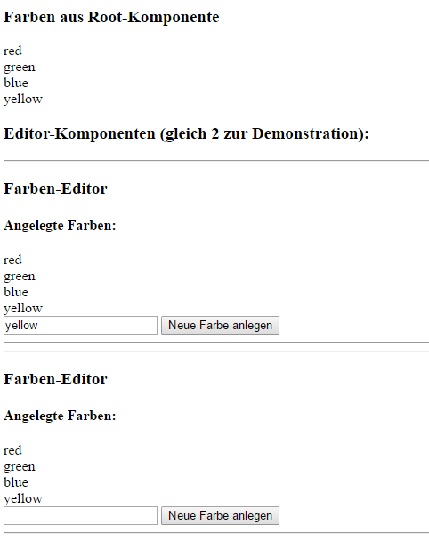
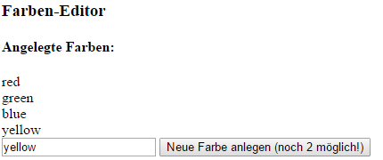
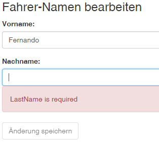
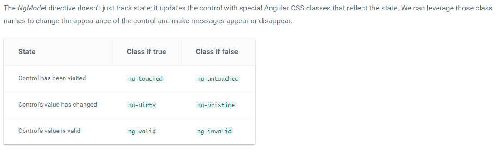

% Angular Services - Dependency Injection  - Komponenten
%
%

---

# 1 Services

Ein Service in Angular ist eine Klasse, welche per Dependency Injection in andere Komponenten oder Services injiziiert werden kann.

Services werden verwendet um Logic bzw. Daten mehreren Komponenten (oder anderen Services) gemeinsam zur Verfügung zu stellen.
 **--> Share logic and data**

## 1.1 Service erstellen und verwenden

Beispiel: Erstelle ein File **app.service.ts** mit folgendem Inhalt
```typescript
import {Injectable} from "@angular/core"

@Injectable({
  providedIn: 'root'
})
export class DataService {
   colors = ["red","green","blue"];
}
```
Zusätzlich soll die Annotation **Injectable** importiert werden und diese Annotation der Klasse zugeordnet werden indem die Annotation vor der Klassendeklaration angegeben wird (immer mit runden Klammern -> Annotationen sind Funktionen). Dadurch 
wird angegeben, dass diese Klasse in andere Klassen injiziiert werden können soll.

Damit der Service mittels Dependency-Injection in Klassen injiziiert werden kann, muss der Service einem Provider zugeordnet werden. Dieser kümmert sich um die Instanz-Erstellung u. Verwaltung.
Standardmäßig wird ein Service einen Provider auf 'root'-Level zugeordnet. Dadurch wird eine einzige Instanz für die gesamte Anwedung erstellt, welche in alle Klassen injiziiert werden kann (also ein Singleton).
Natürlich ist es auch möglich, z.B. eine Instanz je Komponente zu erstellen. (Näheres über Provider auf Komponentenebene folgt unter 1.2.)

Nun kann dieser Service überall, wo er benötigt wird injiziiert werden.
Z.B. in der **app.component.ts**:


```typescript
import { Component } from '@angular/core';
import { Injectable } from '@angular/core';
import { DataService } from './app.service';

@Component({
  selector: 'my-app',
  templateUrl: 'app/app.component.html' 
  })
@Injectable()
export class AppComponent {
   constructor(private myservice: DataService) {
   }
}
```

Hierzu muss dort zunächst die Service-Klasse importiert werden. 

Um nun ein Service verwenden zu können, muss dieses nur im Konstruktor als Eingangsparameter angegeben werden. Durch
Dependency-Injection wird das entsprechende Service-Object dann "automatisch" übergeben.

Als Beispiel können nun im Template zum app.component.ts die Farben, welche in unserem DataService angelegt wurden, ausgegeben werden.
Auf das Service wird mit dem im Constructor angegeben Namen zugegriffen werden:

```html
<div *ngFor="let color of myservice.colors">
    {{color}}
</div>
```

Ausgabe:
```
red
green
blue
```


**Hinweis:**

***constructor(private myservice: DataService)***: Durch die Angabe von **private** wird sofort eine Membervariable in der Klasse angelegt und der übergebene Wert darin gespeichert.
Bei der Alternative ohne private würde folgendermaßen aussehen:
```typescript
...
export class AppComponent {
  myservice: DataService;
  constructor(service: DataService) {
    this.myservice=service;
  }
}
```

## 1.2 Wieviel Service-Instanzen gibt es? Singleton oder nicht?

Ein Provider erstellt eine Instanz zu jedem Service. Wird der Provider im app.modules.ts deklariert, erhalten alle Komponenten diesselbe
Instanz (Singleton).

Möchte man eigene Instanzen für jede Komponente, so muss man auf der jeweiligen Komponentenebene direkt den Service als provider registrieren:

```typescript
import {Component} from '@angular/core';
import {DataService} from '../app.service';

@Component({
  selector: 'color-editor',
  templateUrl: 'app/color-editor/color-editor.component.html',
  providers: [DataService]
})
export class ColorEditorComponent {
  constructor(private myservice: DataService) {
  }
}
```

D.h. wird ein Service als Provider in app.module.ts angegeben, so gibt es nur eine Instanz dieses Service im gesamten Geltungsraum dieses
app.module-Moduls. Wird das Service als Provider in einer Komponente registriert, gibt es eine Instanz je Komponente. 

Natürlich kann man auch eigene Module definieren in deren Geltungsraum dann jeweils eine Serviceinstanz existiert. Module können beliebige
Komponenten etc. zusammenfassen.

Weiter Infos: <https://angular.io/tutorial/toh-pt4>


# 2. Komponenten

**Wichtiger Hinweis ab Angular 16: Seit Signals eigeführt wurden, gibt es neuere Möglichkeiten Parameter zu übergeben und Events zu empfangen. Diese werden im eigenen Tutorial "ComponentTutorial" behandelt. Untenstehende Möglichkeiten sind immer noch gültig.**

Angular-Apps setzen sich aus dem Zusammenwirken von Komponenten zusammen. Es gibt eine Basiskomponente (bootstrap) diese kann weitere beinhalten, etc.

Die Aufteillung auf mehrere Komponenten hat den Vorteil, dass diese einfach auf verschiedenen Stellen wiederverwendet bzw. ausgetauscht werden können. (Vgl. Funktionen)

Häufig benötigen Komponenten Möglichkeiten, um Daten entgegenzunehmen (Input) oder andere Komponenten über Events zu informieren (Output). D.h. mit der übergeordneten Komponente Daten auszutauschen. Auch dies wird in diesem Kapitel erläutert.

## 2.1 Einfache Komponente erstellen

Als Einführungsbeispiel wird eine Color-Editor-Komponente erzeugt, welche Farben aus einem Service (aus Kapitel 1) anzeigt und neue Farben hinzufügen kann.

Unterorder im app-Ordner erstellen. Z.B. **color-editor** (üblicherweise wird Beistrich zur Worttrennung verwendet). In diesem Ordner wird die Komponete z.B. im 
File **color-editor.component.ts** erstellt.

Da der Service aus Kapitel 1 verwendet werden soll, muss der Service importiert und im Konstruktor entgegengenommen werden:

```typescript
import {Component} from '@angular/core';
import {DataService} from '../app.service';

@Component({
  selector: 'color-editor',
  templateUrl: 'app/color-editor/color-editor.component.html',
})
export class ColorEditorComponent {
  constructor(private myservice: DataService) {
  }
}
```

Zu jeder Komponente gehört ein Template. (Gleicher Filename mit .htlm als Extension)

Im Beispiel werden hier die Farben angezeigt und es kann eine neue Farbe ergänzt werden:
```html
<hr/>
    <h3>Farben-Editor</h3>

    <h4>Angelegte Farben:</h4>
    <div *ngFor="let color of myservice.colors">
        {{color}}
    </div>
    <div>   
       <input [(ngModel)]="newColor"/>
       <button (click)="myservice.colors.push(newColor)">Neue Farbe anlegen</button>
    </div>
<hr/>
```

Die neue Komponente wird noch im **app.module.ts** importiert und unter "declarations" registriert:
```typescript
import { NgModule }      from '@angular/core';
import { BrowserModule } from '@angular/platform-browser';
import { FormsModule }   from '@angular/forms';
import { AppComponent }  from './app.component';
import { ColorEditorComponent} from './color-editor/color-editor.component';
import { DataService }   from './app.service';

@NgModule({
  imports:      [ BrowserModule, FormsModule ],
  declarations: [ AppComponent, ColorEditorComponent ],
  providers:    [ DataService ],
  bootstrap:    [ AppComponent ]
})
export class AppModule { }
```

Nun kann die Komponente in anderen Komponenten verwendet werden, indem der unter **selector** angegebenen Name im HTML-Template als Element
angegeben wird.

Z.B. verwenden wir im Folgenden  die neue Color-Editor Komponente testweise gleich 2x in unserer Rootkomponente **app.component.html**:

```html
<h3>Farben aus Root-Komponente</h3>
<div *ngFor="let color of myservice.colors">
    {{color}}
</div>

<h3>Editor-Komponenten (gleich 2 zur Demonstration):</h3>
<color-editor></color-editor>
<color-editor></color-editor>
```

Man erkennt dabei auch sehr gut, dass das DataService-Objekt nur 1x existiert, da der Provider auf  root-Level (providedIn: 'root') registriert wurde: Eine Datenänderung ist daher überall sichtbar.



***Übung: Versuche das Service so zu registrieren, dass jede Color-Editor-Komponente eine eigenen DataService-Instanz injiziiert bekommt.***

## 2.2 Input in Komponente

Möchte man Werte in eine Komponente übergeben, so muss in der Komponente lediglich vor einer Membervariable, welche übergeben werden soll, die 
Annotation **@Input()** angegeben werden. (Input muss dabei wie üblich importiert werden..)

Bsp.: Es soll an die color-editor-Komponente mittels einer Property "maxColors" übergeben werden können, wieviele Farben maximal angelegt werden dürfen:

**color-editor.component.ts:**
```typescript
import {Component, Input} from '@angular/core';
import {DataService} from '../app.service';

@Component({
  selector: 'color-editor',
  templateUrl: 'app/color-editor/color-editor.component.html',
})
export class ColorEditorComponent {
  @Input() maxColors: number=0;
  constructor(private myservice: DataService) {
  }

  addColor(color: string) {
      this.myservice.colors.push(color);
      this.maxColors--;
  }
}
```

Das Hinzufügen einer Farbe wurde in eine Funktion gelegt, da hier auch der Counter erniedrigt werden muss. Die View wird dahingehend angepasst,
dass der Button anzeigt, wieviel Farben noch möglich sind und entsprechend ausgegraut wird, wenn keine Farben mehr erlaubt sind:

**color-editor.component.html:**
```html
<hr/>
    <h3>Farben-Editor</h3>

    <h4>Angelegte Farben:</h4>
    <div *ngFor="let color of myservice.colors">
        {{color}}
    </div>
    <div>   
       <input [(ngModel)]="newColor"/>
       <button [disabled]="maxColors===0" (click)="addColor newColor)">
         Neue Farbe anlegen (noch {{maxColors}} möglich!)
      </button>
    </div>
<hr/>
```

Nun kann der Komponente die max. Farbenzahl die angelegt werden darf übergeben werden:

**app.component.html:**
```html
<h3>Farben aus Root-Komponente</h3>
<div *ngFor="let color of myservice.colors">
    {{color}}
</div>

<h3>Editor-Komponenten (gleich 2 zur Demonstration):</h3>
<color-editor [maxColors]=3></color-editor>
<color-editor></color-editor>
```



## 2.3 Output aus Komponente

Um Daten nach außen zu übermitteln (d.h. von der Child-Komponente zur Parent-Komponente), muss Event-Binding verwendet werden. Hierzu wird zunächst in der
Child-Komponente ein eigenes Output Event deklariert, indem vor einem Member-Field (vom Typ **EventEmitter\<DataTyp>**) die Annotation **@Output** angegeben wird.

Um das Event auszulösen wird dann die Methode **.emit(data)** dieses Events aufgerufen, die Daten können als Parameter übergeben werden.

Bsp.: Wenn ein neuer Farbwert angelegt wurde, soll dies an die aufrufende Komponente per Event mitgeteilt werden können, die neue Farbe soll
dabei als Parameter mitgeliefert werden:

**color-editor.component.ts:**
```typescript
import {Component, Input, Output, EventEmitter} from '@angular/core';
import {DataService} from '../app.service';

@Component({
  selector: 'color-editor',
  templateUrl: 'app/color-editor/color-editor.component.html',
})
export class ColorEditorComponent {
  @Input() maxColors: number=0;
  @Output() colorAdded = new EventEmitter<string>(); //Event erstellen
  constructor(private myservice: DataService) {
  }

  addColor(color: string) {
      this.myservice.colors.push(color);
      this.maxColors--;
      this.colorAdded.emit(color); //Parent-Komponente über neue Farbe informieren
  }
}
```

Nun werden wir in der Parent-Komponente dieses Event abonieren und eine Funktion im eigenen Context aufrufen. Weiters wird die zuletzt angelegte Farbe
ausgegeben:

**app.component.html:**
```html
<div>
    Zuletzt hinzugefügte Farbe: {{lastColor}}
</div>
<h3>Editor-Komponenten (gleich 2 zur Demonstration):</h3>
<color-editor [maxColors]=3  (colorAdded)="newColorAdded($event)"></color-editor>
<color-editor></color-editor>
```

An die Funktion newColorAdded wird mittels $event das mit .emit übergebene Objekt (in unserem Fall ein string mit der neuen Farbbezeichnung) übergeben. Implementierung in
**app.component.ts:**
```typescript
import { Component } from '@angular/core';
import { Injectable } from '@angular/core';
import { DataService } from './app.service';

@Component({
  selector: 'my-app',
  templateUrl: 'app/app.component.html' 
  })
export class AppComponent {
   lastColor: string="";
   constructor(private myservice: DataService) {
   }

   newColorAdded(newColor: string) {
     this.lastColor=newColor;
   }
}
```

## 2.4 Properties/ Auf Änderung eines Eingabewertes reagieren

Wenn sich ein Eingabewert einer Komponente ändert, so muss
oftmals darauf reagiert werden (z.B. neue Datensätze laden).

Eine einfache Form ist dies mittels Properties zu implementieren. 
Dabei können im Setter der Property die erforderlichen Aktionen implementiert werden:

```typescript
@Input()
  set selectedHotelId(value: number) {
    this._selectedHotelId = value;
    this.calcAverage();
  }
  get selectedHotelId(): number {
      return this._selectedHotelId;
  }
```

Alternativ kann mittels ngOnChanges auf Änderungen reagiert werden.

# 3. Component-Lifecycle

Eine Komponente in Angular 2 durchläuft verschiedene Zustände während der Ausführung. Diese werden
auch Lebenszyklen genannt. Über die Lifecycle-Hooks können wir hier an verschiedenen Stellen eingreifen.

Um an entsprechender Stelle reagieren zu können, muss jeweils ein Interface implementiert werden, welches dann eine der untenstehenden
Funktionen definiert.

Folgende Funktionen können dazu genutzt werden:
* ngOnInit - Komponente wird Initialisiert (nach erstem ngOnChanges). Dies ist ein guter Punkt um die Daten
für die Komponente zu laden. (Im Konstruktor ist dies zu vermeiden!)
* ngOnDestroy - bevor Komponente zerstört wird
* ngDoCheck - eigene Änderungserkennung
* ngOnChanges(changes) - Änderungen in Bindings wurden erkannt

* ngAfterContentInit - Inhalt wurde initialisiert
* ngAfterContentChecked - jedes Mal, wenn Inhalt überprüft wurde
* ngAfterViewInit - Views wurden initialisiert
* ngAfterViewChecked - jedes Mal, wenn Views überprüft wurden

Beispiel:

```typescript
import { Component, OnInit } from '@angular/core';

@Component({
  selector: 'my-app',
  template: `<h1>Hello {{name}}</h1>`,
})
export class AppComponent implements OnInit  {
  
   name = 'Angular'; 
  
   ngOnInit() {
     this.name="Angular initialized";
   }
}
```


Beispiel:

Eingangsparameter geändert (ngOnChange):

```typescript
ngOnChanges(changes: SimpleChanges) {
  for (let propName in changes) {
    let chng = changes[propName];
    let cur  = JSON.stringify(chng.currentValue);
    let prev = JSON.stringify(chng.previousValue);
    this.changeLog.push(`${propName}: currentValue = ${cur}, previousValue = ${prev}`);
  }
}
```

auf bestimmtes Property reagieren:

```typescript
ngOnChanges(changes: SimpleChanges): void {
    let change=changes["slotsLeft"];
    if (change!=null)
    {
        alert("Value changed to "+change.currentValue);
    }  
  }
```
# 4. HttpClient-Service

Das HTTP-Service ist ein vorgefertigtes Service für den REST-Zugriff über HTTP (API).

Es stehen
die HTTP-Requests  GET, POST, PUT, PATCH, DELETE und  zur Verfügung.

## 4.1 HTTP-Service einbinden

### 4.1.1 Service registrieren (neue Version mit standalone components)

Im File app.config.ts (oder ähnlich) wird der Service registriert. Hierbei wird der Service als Provider angegeben.
D.h. es wird **provideHttpClient()** ergänzt.

```typescript
import { ApplicationConfig, provideZoneChangeDetection } from '@angular/core';
import { provideRouter } from '@angular/router';

import { routes } from './app.routes';
import { provideHttpClient } from '@angular/common/http';

export const appConfig: ApplicationConfig = {
  providers: [provideZoneChangeDetection({ eventCoalescing: true }), 
    provideRouter(routes), provideHttpClient()]
};
```

### 4.1.2 Service registrieren (alte Version mit app.module.ts)


Service registrieren (im app.module.ts):

```typescript
...
import { HttpClientModule }    from '@angular/common/http';

@NgModule({
  imports: [ ...
             HttpClientModule]
...
```

## 4.2 CORS - Cross Origin Resource Sharing

Folgendes ist für die Erstellung des WebServices relevant. 

Standardmäßig darf eine Website nur auf Resourcen die am selben Webserver wie die Website liegt zugreifen (Same-Origin-Policy = SOP).
D.h. allerdings auch, dass auf Webservices (z.B. ReST) die auf einem anderen Server liegen normalerweise nicht zugegriffen werden kann. Bzw. der 
Webservice nur von Websiten die am selben Server liegen genutzt werden könnte. 

Wenn man sein Service auch für andere Webseiten zur Verfügung stellen will, muss CORS aktiviert werden.

Damit die Anfrage einer Webseite, z.B. http://demowebsite.com, an einen Server einer abweichenden Domain, z.B. http://mydataservice.com, erfolgreich durchgeführt werden kann, 
muss der Server bei seiner Antwort den Zugriff durch entsprechende HTTP-Header erlauben, ansonsten wird der Browser einen Fehler melden.

Wird ein ReST-Service mittels ASP.Net erstellt, kann CORS folgendermaßen aktiviert werden. Bei den untenstehenden Beispielen wird CORS uneingeschränkt 
aktiviert.
Natürlich können auch eine Vielzahl von Einschränkungen (welche Aktion, welcher Website, welche Methode - Post, Get....) getroffen werden, 
darauf wird jedoch an dieser Stelle nicht näher eingegangen. Dies kann einfach in Online-Dokumentationen (Goolge-Suche: Cors Asp.Net) nachgelesen werden.


**Asp.Net Core:**

https://docs.microsoft.com/en-us/aspnet/core/security/cors

- Zunächst in der Program.cs Klasse den CORS-Service registrieren.
```csharp
builder.Services.AddCors();
```

- Dann wird in der Configure Methode einfach folgende Middleware ergänzen:

```csharp
    app.UseCors(builder => builder.AllowAnyOrigin().AllowAnyHeader().AllowAnyMethod());
```


## 4.3 HTTP-GET

Bsp.: In einem eigenem Service (CustomerService) wird eine Methode (getAllCategories) implementiert, um Daten von einem API-Server per Get-Anfrage zu 
beziehen. Der oben (im Punkt 4.1) registrierte HTTP-Service wird in den Constructor injiziiert.

Mittels *this.http.get* wird die eigentliche Anfrage gestellt --> die URL des Rest-Services wird übergeben.
Rückgabewert von .get ist ein Observable. (Asynchron!)

```typescript
import { Injectable } from '@angular/core';
import { HttpClient } from '@angular/common/http';
import { Customer } from '../models/customer.model';

@Injectable({
  providedIn: 'root'
})
export class CustomerService {
  customerUrl="http://localhost:3000/customers" //API URL
  
  constructor(private http: HttpClient) { }

  getAllCustomers() {
    return this.http.get(this.customerUrl);
  }
}
```

Oben ist die untypisierte Variante. Aufgrund Typsicherheit ist untenstehende Variante mit generischem get empfohlen. Der vom Rest-Serive
zurückgeliefete Typ wird beim .get angegeben. In diesem Fall wird ein Array von Kunden vom Server zurückgeliefert.

```typescript
import { Observable } from 'rxjs'
...
// TYPISIERTE VARIANTE liefert Observable<Customer[]>:
getAllCustomers():Observable<Customer[]> {
  return this.http.get<Customer[]>(this.customerUrl);
}
```

Im app.component.ts wird dann die Methode getAllCustomers() aufgerufen (über den injiziierten Service),
 um die Daten zu laden und im Template anzuzeigen.

Da es sich bei den http Aufrufen um asynchrone Anfragen handelt, kommt das Ergebnis erst zeitverögert. Die Applikation 
blockiert hier jedoch nicht, sondern die Programmausführung wird nach dem Absetzen der Anfrage mit weitergeführt.

Deshalb wird auf den Rückgabewert von getAllCustomers() (Typ: Observable<Customer[]>) ein .subscribe angewandt.
Erst wenn die Antwort des Requests vorliegt, wird die an Subscribe übergebene Lambda-Methode ausgeführt! 
(Achtung! D.h. Programmzeilen die nach dem Aufruf der getAllCustomers() stehen werden ev. ausgeführt, bevor die Rest-Abfrage fertiggestellt wurde.)


```typescript
import { Component, OnInit } from '@angular/core';
import { Customer } from './models/customer.model';
import { CustomerService } from './services/customer.service';

@Component({
  selector: 'app-root',
  templateUrl: './app.component.html',
  styleUrls: ['./app.component.css']
})
export class AppComponent implements OnInit {
  
  customers: Customer[];
  
  constructor(private customerService: CustomerService ) {  }

  ngOnInit(): void {
    this.customerService.getAllCustomers()
    .subscribe((data:Customer[]) => 
      {
        this.customers=data;     
      });   
  }
}
```

Möchte man als Resultat nicht nur die Daten, sondern das gesamte Response Objekt so kann bei der Get-Anfrage 

getConfigResponse(): Observable<HttpResponse<Config>> {
  return this.http.get<Config>(
    this.configUrl, { observe: 'response' });
}

## 4.4 HTTP-Post

Bei Post, Update, Delete und Patch muss bei der Rest-Anfrage ein Header mitgeliefert werden. 
Damit HttpHeaders verwendet werden kann, muss entsprechender Import ergänzt werden.
Der jeweilige Header kann als const-Object vom Typ HttpHeaders im Kopf des Service definiert werden. Dadurch kann bei den einzelnen
Anfragen derselbe Header verwendet werden. Alternativ kann der Header natürlich direkt in der jeweiligen Methode definiert werden.


Header festlegen: 

```typescript
import { HttpHeaders } from '@angular/common/http';

const httpOptions = {
  headers: new HttpHeaders({
    'Content-Type':  'application/json'
  //,'Authorization': 'my-auth-token'
  })
}
```
Hinweis: Für token based authentication wird normalerweise das Token bei jeder Anfrage mitübertragen, dies wurde hier zunächst
auskommentiert

Http-Post Methode:

```typescript
  addCustomer(newCustomer: Customer) {
   
   //httpOptions wurde außerhalb der Klasse als const definiert (siehe oben unter Header festlegen)
    
   return this.http.post<Customer>(this.customerUrl,newCustomer, httpOptions});
  }}
```

In der jeweiligen Komponente kann nun die Methode zum Aufruf des POST Requests verwendet werden.m 


```typescript
addNewCustomer() {
    this.customerService.addCustomer(this.newCustomer)
       .subscribe((data:Customer) => 
         {
            this.newCustomer.firstname="";
            this.newCustomer.lastname="";
            this.newCustomer.country="";
            this.refreshCustomers(); 
         });
  }
```

Um diesen Fehler zu behandeln kann der .subscribe Methode ein zweiter Parameter übergeben werden. 
Beispiel - Film mittels oberer Methode anlegen und Fehler behandeln:

### 4.4.1 Einfache Fehlerbehandlung

Eine recht einfache Art der Fehlerbehandlung ist im subscribe noch einen zweiten Paramter anzugeben, bei dem eine Lambda-Expression 
übergeben wird, die dann im Fehlerfall aufgerufen wird. Eingangsparameter ist ein error-Object welches unter anderem die Fehlermeldung 
in der Property message bereitstellt:

```typescript
 addNewCustomer() {
    this.customerService.addCustomer(this.newCustomer)
       .subscribe(
       {
         next: (data:Customer) => 
         {
            this.newCustomer.firstname="";
            this.newCustomer.lastname="";
            this.newCustomer.country="";
            this.refreshCustomers(); 
         },
         error: (error)=>
         {
             alert("Fehler beim Speichern: "+error.message);
             console.error("Fehler beim Speichern: "+error.message);
         }
        });
  }
```
Im obigen Beispiel wird im Fehlerfall (z.B. falsche API-Url) die Fehlermeldung als Alert-Dialog ausgegeben und in der Console protokolliert. 

Hinweis: Weitere Details zu Fehlerbehandlungsmöglichkeiten: https://angular.io/guide/http

### 4.4.2 Erweiterte Fehlerbehandlung mit errorCodes

Um auf spezielle Fehler, welche am API-Server aufgetreten sind, in der Angular-App reagieren zu können, wird vom API-Server im Fehlerfall ein BadRequest zurückgeliefert. Beim dabei mitgelieferten Response wird auch ein **errorText** und ein **errorCode** mitgeliefert, damit der Client die entsprechende Fehlermeldung ausgeben kann, bzw. passend reagiert.

Serverseitig (API-Service):

```typescript
[ProducesResponseType(typeof(List<Usage>), StatusCodes.Status201Created)]
[ProducesResponseType(StatusCodes.Status400BadRequest)]
[HttpPost()]
public async Task<IActionResult> Post(UsagePostDto usagePostDto)
{
    if (!ModelState.IsValid)
    {
        return BadRequest();
    }
    Usage usage = new Usage()
    {
        Device_Id = usagePostDto.Device_Id,
        Person_Id = usagePostDto.Person_Id,
        From = usagePostDto.From,
        To = usagePostDto.To
    };

    if (!await _unitOfWork.UsageRepository.IsDeviceAvailableAsync(usage))
    {
        return BadRequest(new {errorText="Device zu diesem Termin nicht verfügbar!", errorCode=2}); 
        //Device nicht verfügbar
    }
    _unitOfWork.UsageRepository.Add(usage);
    await _unitOfWork.SaveChangesAsync();
    return Ok(usage);
}
```

In der Angular-App wird auf den Fehlerfall reagiert:

```typescript
 onSubmit(usageForm: NgForm) {
    if (usageForm.valid) {
      // Speichern
      this.usageService.post(this.newUsage).subscribe({next:
        data => {
          this.isMsgDeviceNotAvailableVisible = false;
          this.router.navigate(['/usage-list']);
        },
        error: error => {
          if (error.error.errorCode === 2) {
            this.errorText = error.error.errorText;
            this.isMsgDeviceNotAvailableVisible = true;
          } else {
            alert('Speichern fehlgeschlagen!');
          }
        }});
    }
    this.isTriedToSubmit = true;
  }
```


## 4.5. HTTP-Delete

Bei einem Delete muss in der URL die Id des zu löschendem Objektes übergeben werden:

```typescript
deleteCustomer(id: number) {
    return this.http.delete(this.customerUrl+"/"+id,httpOptions);
}
```

## 4.6. HTTP-Put

Bei Put wird ein Objekt/Entität geändert. Dabei wird das gesamte Objekt übergeben und alle Felder werden aktualisiert. D.h. auch nicht zu ändernde
Felder müssen übergeben werden, diese dann mit den "alten" Werten.

In der URL die Id des zu löschendem Objektes übergeben werden, zusätzlich wird das gesamte Objekt mit den neuen 
Feldinhalten übergeben (alle Felder werden aktualisiert):


```typescript
updateCustomer(customer: Customer): Observable<Customer> {
    return this.http.put<Customer>(this.customerUrl+"/"+customer.id,customer,httpOptions);
}
```

## 4.7. HTTP-Patch

Beim Patch wird nicht das gesamte Objekt übergeben, sondern nur die zu ändernden Felder

```typescript
patchCustomer(id: number, changeFields:any): Observable<Customer> {
    return this.http.patch<Customer>(this.customerUrl+"/"+id,changeFields,httpOptions);
  }
```

Beispiel: 
In einer Komponente wird obige Patch Methode aufgerufen. Es soll dabei z.B. nur das Land bei einem Kunden auf unbekannt gesetzt werden:

```typescript
clearCountryWithPatch(customer: Customer) {
    let changeFields = {country:"unbekannt"};
    this.customerService.patchCustomer(customer.id,changeFields)
     .subscribe(
       {
         next: (data:Customer)=>
        {
          this.refreshCustomers(); 
        }
        ,error: (error)=>
        {
            alert("Fehler beim Patch: "+error.message);
            console.error("Fehler beim Patch: "+error.message);
        }
       });
}
```
## 4.8. HttpParams
Um Url-Parameter zu erzeugen ist insbesondere bei Verwendung von Sonderzeichen im zu übergebenen Parameter die HttpParams Klasse nützlich. Auch bei optionalen Parameter ist diese nützlich (da der 1. Paramter mit ? und die weiteren mit & ergänzt werden: "...?name=Max&age=17"):

```typescript
    let params = new HttpParams();
    if (this.filterByName !== undefined) {
      params = params.append("name", this.filterName);
    }

    if (this.filterByAge) {
      params = params.append("age", this.filterAge);
    }

    const paramsString = params.toString();

    return this.http.get<Pupil[]>(`${environment.apiBaseUrl}/
      api/pupils${paramsString ? '?' : ''}${paramsString}`);
```
# 5. Directiven

Es gibt drei Arten von Directiven in Angular

- Components: Entspricht einer Directive mit einem Template
- Structural directives: Verändern den DOM (z.B. ngIf, ngFor)
- Attribute directives: Verändern das Verhalten oder das Aussehen von Elementen, Komponenten
oder anderen Directiven

## 5.1. Eigene Attribute-Directiven erstellen

Bsp.: Es wird eine Directive myHighlight erstellt (Hintergrundfarbe des jeweiligen Elements wird verändert,
wenn mit Maus darübergefahren wird).

```html
<p appHighlight>Highlight me!</p>
```

```typescript
import { Directive, ElementRef, Input, HostListener } from '@angular/core';
@Directive({ selector: '[appHighlight]' })
export class HighlightDirective {
  constructor(private el: ElementRef) { }

  @HostListener('mouseenter') onMouseEnter() {
    this.highlight('yellow');
  }

  @HostListener('mouseleave') onMouseLeave() {
    this.highlight(null);
  }

  private highlight(color: string) {
    this.el.nativeElement.style.backgroundColor = color;
  }
}
```

Im app.modules.ts muss die Directive noch als Komponente registriert werden:

```typescript
import { NgModule } from '@angular/core';
import { BrowserModule } from '@angular/platform-browser';
import { AppComponent } from './app.component';
import { HighlightDirective } from './highlight.directive';
@NgModule({
  imports: [ BrowserModule ],
  declarations: [
    AppComponent,
    HighlightDirective
  ],
  bootstrap: [ AppComponent ]
})
export class AppModule { }
```

**Parameter an Directive übergeben**
Bis jetzt wird der Hintergrund immer auf gelb gesetzt. 
Wenn man die Hintergrundfarbe als Parameter übergeben möchte, sind kleine Anpassungen erforderlich:

Übergabe an Directive:
```html
<p appHighlight highlightColor="yellow">Highlighted in yellow</p>
<p appHighlight [highlightColor]="'orange'">Highlighted in orange</p>
```

In der Directive einfach einen Eingabeparameter definieren (genauso wie bei anderen Komponenten): (@Input)
```typescript
@Input() highlightColor: string;
```


# 6. Routing und Navigation

Angular Routes erlauben es von einer View zu einer anderen navigieren zu können, z.B. nach Klick auf einen Link. Die angezeigte Komponente wird dabei ausgetauscht
und es können Parameter übergeben werden.
Somit kann eine Anwendung (scheinbar) auf mehrere "Seiten" aufgeteilt werden.

Angular-Router erlaubt es:

- Mit Vor und Zurück-Button zwischen den besuchten Setien zu navigieren
- Direkt eine URL einzugeben, diese wird interpretiert und die richtige Komponente angezeigt
- Links können direkt mit einer Route verbunden werden. Paramterübergabe möglich.

## 6.1. Routing einbauen

**base href**

Als erstes Element im head von index.html sollte folgender Eintrag ergänzt werden. Um den Router mitzuteilen wie die URL zusammengesetzt werden sollen.

```html
<base href="/">
```

**Hinweis Angular-CLI**
Wird ein Projekt mittels Angular-CLI erzeugt und dabei Routing ausgewählt, so wird Router-Service und die Routen Konfiguration in einem eigenem
Module zusammengefasst, welches wiederum im app.module.ts eingebunden ist. 
Untenstehende Punkte sind daher fallweise im *app-routing.module.ts* zu finden.


**Router service importieren**

Im app.module.ts
```typescript
import { RouterModule, Routes } from '@angular/router';
```

**Routen konfigurieren**
Eine Angular-Applikation mit Routen hat eine Singleton-Instanz des Router Service. Wenn die Browser-URL sich ändert,
ermittelt der Router die entsprechend anzuzeigende Komponente aus der Routen-Konfiguration.

Routen müssen definiert werden (app.module.ts).

```typescript
import { NgModule }      from '@angular/core';
import { BrowserModule } from '@angular/platform-browser';
import { FormsModule } from '@angular/forms';
import { HttpModule, JsonpModule } from '@angular/http';
import { AppComponent }  from './app.component';
import { RouterModule, Routes } from '@angular/router';
import { PupilListComponent} from './pupils/pupil-list/pupil-list.component';
import { PupilComponent } from './pupils/pupil/pupil.component';
import { HomeComponent } from './home/home.component';

const appRoutes: Routes = [
  {path: 'home', component: HomeComponent},
  {path: 'pupillist', component: PupilListComponent},
  {path: 'pupil/:id', component: PupilComponent},
  {path: '', redirectTo: '/home', pathMatch:"full"},
  //{ path: '**', component: PageNotFoundComponent },  // Wildcard route for a 404 page
];

@NgModule({
  imports: [ 
             RouterModule.forRoot(appRoutes),
             BrowserModule,  
             FormsModule,
             HttpModule,
             JsonpModule ],
  declarations: [ AppComponent, PupilComponent, PupilListComponent, HomeComponent],
  bootstrap: [ AppComponent ]
})
export class AppModule { } 
```

Es wurden oberhalb drei Routen definiert. 
Die erste Route definiert dass die Url **.../home** die Kompontente HomeComponent anzeigen soll.  
Bei der zweiten Route ist ein Beispiel angeführt, wie man einen Parameter an eine Zielkomponente über den Router übergeben kann (Siehe Punkt 6.2).
In der letzten Route-Definition (path: '') wurde festgelegt, dass ohne Angabe eines Pfades zu /home umgeleitet wird.

**Router outlet / Router link**

RouterOutlet ist ein HTML-Element und dient als Platzhalter für die jeweiligen Ziel-Komponenten der Route (also den einzelnen "HTML-Seiten"). D.h. an dieser Stelle werden die jeweiligen
Komponenten die den einzelnen Routen zugeordnet wurden angezeigt.

In der Start-Komponente wird üblicherweise dieser RouterOutlet platziert. Im Beispiel sind im oberen Bereich zwei Links angebracht um zwischen zwei
Seiten hin und herschalten zu können und darunter der Platzhalter für die jeweiligen Seiten.
Einem Link (Anchor Element) kann mittels der routerLink-Directive das Ziel des Links angegeben werden. Mittels RouterLinkActive können CSS Klassen
angegeben werden (mit Leerzeichen getrennt), welche dem Anchor Element hinzugefügt werden sollen wenn der Link aktiv ist (sie werden entfernt wenn er inaktiv ist):

app.component.html:
```html
<h1>Router-Demo</h1>
<nav>
    <a routerLink="/home" routerLinkActive="active">Home</a>
    <a routerLink="/pupillist" routerLinkActive="active">Schülerliste</a>
</nav>
<router-outlet></router-outlet>
```

in **routerLinkActive** können CSS-Klassen angegeben werden, welche dem Element automatisch hinzugefügt
werden sollen, wenn der angegebene routerLink mit der derzeit angezeigten Seite (aktiven Seite) übereinstimmt.

Anwendungsbeispiel: In einer Navbar wird die aktuelle Seite z.B. fett markiert (zugehöriges CSS):

```html
.active {
    font-weight: bold
}
```


**Komponente HomeComponent**
```typescript
import { Component } from '@angular/core'

@Component(
    {
        selector: 'home',
        template: `
          <h4>Willkomen zur Startseite der Routing-Demo-Applikation</h4>   
        `      
    }
)
export class HomeComponent {
}

```

**Komponente PupilListComponent**
```typescript
import { Component } from '@angular/core'

@Component(
    {
        selector: 'pupil-list',
        template: `
          <h1>Schülerliste</h1>
          <table>
            <tr>
              <td>Sepp Mustermann</td>
              <td>
                 <a routerLink="/pupil/1" routerLinkActive="active">Details</a>
              </td>
            </tr>
            <tr>
              <td>Doris Musterfrau</td>
              <td>
                 <a routerLink="/pupil/2" routerLinkActive="active">Details</a>
              </td>
            </tr>
          </table>       
        `      
    }
)
export class PupilListComponent {
}
```


## 6.2. Route: Parameter übergeben

### 6.2.1 Parameter auslesen

Wie aus einer definierten Route z.B. "pupil/:id" in der Ziel-Komponente die id empfangen werden kann, soll folgendes Beispiel veranschaulichen.

In der Komponente an die der Parameter übergeben wird, müssen zunächst einige Importe ergänzt werden:

```typescript
import { Router, ActivatedRoute, ParamMap } from '@angular/router';
```
Im Konstruktor werden die benötigten Services importiert. Im ngOnInit wird der Parameter "observiert" (Änderung abonniert), dies hat den Grund, dass
der Parameter sich auch ändern könnte:

>In this example, you retrieve the route params from an Observable. That implies that the route params can change during the lifetime of this component.
>They might. By default, the router re-uses a component instance when it re-navigates to the same component type without visiting a different component first. The route parameters could change each time.

```typescript
export class PupilComponent implements OnInit {
  actId: number=0;
  
  constructor(
    private activatedRoute: ActivatedRoute,
    private router: Router
  ) {}
  
  ngOnInit() {
      this.activatedRoute.params.subscribe(
       (params: Params) => {
          this.actId=Number(params['id']); //Number(...) wandelt string in number um
          //this.loadPupil(); //z.B. Schüler per REST laden
       }
     );
              
  }
}
```

### 6.2.2 Url Parameter in Route verwenden (als Teil der Url: z.B ("/pupildetail/2"))

```html
    <tr *ngFor="let pupil of pupils">
      <td>{{pupil.id}}</td>
      <td>{{pupil.firstName}}</td>
      <td>{{pupil.lastName}}</td>
      <td>{{pupil.age}}</td>   
      <td><a class="btn btn-primary" 
        [routerLink]="['/deletepupil',pupil.id]">Delete</a>
    </tr>
```


### 6.2.3 Url Parameter in Route verwenden (als Query-Param)

Teilweise möchte man Paramater als URL-Parameter anführen.
**pupils?id=5**

Route mit URL-Parameter in HTML-Template aufrufen:

```html
    <tr *ngFor="let pupil of pupils">
      <td>{{pupil.id}}</td>
      <td>{{pupil.firstName}}</td>
      <td>{{pupil.lastName}}</td>
      <td>{{pupil.age}}</td>   
      <td><a class="btn btn-primary" [routerLink]="'/deletepupil'" 
      [queryParams]="{id: pupil.id}">Delete</a>
    </tr>
```

In der Zielkomponente kann dann der übergebene Url-Parameter folgendermaßen ausgelesen werden:

```typescript
export class PupilDeleteComponent implements OnInit {

  actId=0;
  constructor(private activatedRoute: ActivatedRoute,
   private pupilService: PupilService, private router: Router) { }

  ngOnInit(): void {
     this.activitatedRoute.queryParams.subscribe(
       params=>{
         this.actId=params['id'];
       }
     )
  }
 }
}
```


### 6.2.4 Url auslesen

Es kann fallweise notwendig sein, die URL auszulesen, welche zur aktuellen Komponente geführt hat. Zum Beispiel, wenn mehrere URL´s 
zur selben Komponente führen und dort die Fälle unterschieden werden sollen.

```typescript
actUrl=this.router.url; 
```

router Instanz muss im Konstruktur per Dependency Injection entgegengenommen werden.

## 6.3. Route per Code aufrufen

Beispiel: Es soll zu einer Route nach einem Mausklick navigiert werden. Auslösen der Navigation durch Methode .navigate. 

Beachte dass *router* im Constructor injiziiert wurde. (Singleton-Instanz des Router-Service)

```typescript
import { Component } from '@angular/core'
import { Router } from '@angular/router'

@Component(
    {
      ... 
    }
export class PupilListComponent {
  constructor(private router: Router)  {

  }
  buttonClicked() {
    this.router.navigate(['/pupil', actPupil.id]);
  }
}
```

## 6.4. Child-Routes

**Erläuterung mittels einem Beispiel:**

If the user clicks on the product with ID 3, we want to show the product details page with the overview:

localhost:3000/product-details/3/overview

When the user clicks "Technical Specs":

localhost:3000/product-details/3/specs

overview and specs are child routes of product-details/:id. They are only reachable within product details.

Our Routes with children would look like:

```typescript
export const routes: Routes = [
  { path: '', redirectTo: 'product-list', pathMatch: 'full' },
  { path: 'product-list', component: ProductList },
  { path: 'product-details/:id', component: ProductDetails,
    children: [
      { path: '', redirectTo: 'overview', pathMatch: 'full' },
      { path: 'overview', component: Overview },
      { path: 'specs', component: Specs }
    ]
  }
];
```

# 7. Pipes

Pipes dienen zur Transformation (Formatierung) von Daten zur Ausgabe

Format: expression | pipe

## 7.1. Build-in Pipes:

```html
<p>The hero's birthday is {{ birthday | date:"MM/dd/yy" }} </p>

The chained hero's birthday is
{{  birthday | date:'fullDate' | uppercase}}

<p>{{ object | json }}</p> <!-- JSON.stringify -->
```

## 7.2. Custom Pipes

```typescript
import { Pipe, PipeTransform } from '@angular/core';
/*
 * Raise the value exponentially
 * Takes an exponent argument that defaults to 1.
 * Usage:
 *   value | exponentialStrength:exponent
 * Example:
 *   {{ 2 |  exponentialStrength:10}}
 *   formats to: 1024
*/
@Pipe({name: 'exponentialStrength'})
export class ExponentialStrengthPipe implements PipeTransform {
  transform(value: number, exponent: string): number {
    let exp = parseFloat(exponent);
    return Math.pow(value, isNaN(exp) ? 1 : exp);
  }
}
```

**Die Pipe muss im declarations-Teil von app.module.ts registriert werden!**

Eigene Pipe kann dann in Komponenten verwendet werden:

```typescript
import { Component } from '@angular/core';

@Component({
  selector: 'power-booster',
  template: `
    <h2>Power Booster</h2>
    <p>Super power boost: {{2 | exponentialStrength: 10}}</p>
  `
})
export class PowerBoosterComponent { }
```


# 8. Tests

# 9. Bootstrap

Um Bootstrap gemeinsam mit Angular verwenden zu können, ist folgendes Package zu installieren:

Installation von Bootstrap mit npm:
```
npm install bootstrap
```

Zusätzlich im styles.css des Angular Projektes folgende Zeile ergänzen:
```
@import "~bootstrap/dist/css/bootstrap.min.css"
```

Nach der Installation im Visual-Studio Code den Blitz (links unten) klicken um Intellisense zu aktualisieren (CSS Classes cache again). Alternativ VS-Code neu starten.

# 10. Forms

Wie bisher gesehen, können Eingabeformulare mit Eingabefelder und einem Speichern-Button
implementiert werden.
Verwendet man stattdessen ein HTML-Form Element, erhält man weitere Möglichkeiten
(z.B. Validierung)

https://angular.io/guide/forms

Bsp.:

```html
<div class="container">
  <h3>Fahrer-Namen bearbeiten</h3>
  <form (ngSubmit)="onSubmit(driverForm)" #driverForm="ngForm">
    <div class="form-group">
      <label for="givenName">Vorname:</label>
      <input class="form-control" id="givenName" type="text" 
        [(ngModel)]="editGivenName" name="editGivenName" [disabled]="selectedDriver==null"/>
    </div>
    <div class="form-group">
      <label for="familyName">Nachname:</label>
      <input class="form-control" id="familyName" type="text" #lastName="ngModel"
         [(ngModel)]="editLastName" name="editLastName" required [disabled]="selectedDriver==null"/>
      <div [hidden]="lastName.valid || lastName.pristine"  class="alert alert-danger">
         LastName is required
      </div>
    </div>
    <button type="submit" class="btn btn-default" 
      [disabled]="(selectedDriver==null) || (!driverForm.form.valid)">Änderung speichern</button>
  </form>
</div>
```

pristine: Ist true, wenn das Feld seit der Initialisierung (dem Laden) noch nicht verändert wurde. 

Im Controller muss die Methode die im (ngSubmit) Attribut des Forms angegeben wurde implementiert
werden:

```typescript
  onSubmit(driverForm: NgForm) {
    if (driverForm.valid) {
      this.selectedDriver.givenName = this.editGivenName;
      this.selectedDriver.familyName = this.editLastName;
      this.driverService.post().subscribe({
        next: data=>{this.selectedDriver=data},
        error: error=>{
          alert("Fehler beim Speichern: "+error.message);
        }
      });
    }
  }
```





Um die Optik der Validierung noch etwas zu verschönern, kann z.B. ein roter/grüner vertikaler Strich am Beginn des Eingabefelds
den aktuellen Gütligkeitsstatus anzeigen:

CSS:
```typescript
.ng-valid[required], .ng-valid.required 
    { border-left: 5px solid #42A948; /* green */ } 
.ng-invalid:not(form) 
    { border-left: 5px solid #a94442; /* red */ }
```

## 10.1 Forms Validation

Folgende vorgefertigte (build-in) Validatoren stehen zur Verfügung:

```typescript
class Validators {
  static min(min: number): ValidatorFn
  static max(max: number): ValidatorFn
  static required(control: AbstractControl): ValidationErrors | null
  static requiredTrue(control: AbstractControl): ValidationErrors | null
  static email(control: AbstractControl): ValidationErrors | null
  static minLength(minLength: number): ValidatorFn
  static maxLength(maxLength: number): ValidatorFn
  static pattern(pattern: string | RegExp): ValidatorFn
  static nullValidator(control: AbstractControl): ValidationErrors | null
  static compose(validators: ValidatorFn[]): ValidatorFn | null
  static composeAsync(validators: AsyncValidatorFn[]): AsyncValidatorFn | null
}
```

Soll eine Fehlermeldung abhängig vom Validierungsfehler ausgegeben werden, so kann danach unterschieden werden. Im folgendem Beispiel soll eine unterschiedliche Fehlermeldung ausgegeben werden, wenn der Nachname gar nicht eingegeben wurde (required) und wenn nur ein Zeichen eingegeben wurde (minlength):

```html
<form (ngSubmit)="onSubmit(pupilForm)" #pupilForm="ngForm">
  <div>
    <label for="firstName">Vorname</label>
    <input type="text" class="form-control validatable" [(ngModel)]="pupil.firstName" id="firstName"
      name="editFirstName">
  </div>
  <div>
    <label for="lastName">Nachname</label>
    <input type="text" class="form-control validatable" [(ngModel)]="pupil.lastName" id="lastName"
    name="editLastName" required minlength="2" #lastName="ngModel">
    <div [hidden]="lastName.valid || lastName.pristine" class="alert alert-danger">
      <div *ngIf="lastName?.errors?.['required']">Nachname muss eingegeben werden!</div>
      <div *ngIf="lastName?.errors?.['minlength']">Nachname muss mindestens 2 Zeichen lang sein!</div>
    </div>
  </div>
  <input type="submit" value="Speichern">
</form>
```

Details: https://angular.io/api/forms/Validators

## 10.2 Eigene Validierungs-Direktiven

### 10.2.1 Mittels Validator Interface
```typescript
import { Directive, Input } from '@angular/core';
import { NG_VALIDATORS, Validator, AbstractControl, ValidationErrors } from '@angular/forms';

@Directive({
  selector: '[appRange]',
  providers: [{provide: NG_VALIDATORS, useExisting: RangeDirective, multi: true}]
})
export class RangeDirective implements Validator {
  @Input() appFrom: number|undefined;
  @Input() appTo: number|undefined;

  validate(control: AbstractControl): ValidationErrors | null {
    if (this.appFrom!=undefined&&this.appTo!=undefined) {
      const valid = control.value>=this.appFrom && control.value<=this.appTo;
      return !valid ? {'appRange': {value: control.value}} : null;
      //appRange key landet im Fehlerfall im .errors
    }
    return null;
  }
}
```

### 10.2.2 Mittels Validator Interface und Validator-Function (ValidatorFn)

Zunächst wird eine Klasse für die Validator Directive erstellt.

z.B.: ng g directive core/directives/range

Code:

```typescript
import { Directive, Input } from '@angular/core';
import { NG_VALIDATORS, Validator, AbstractControl, ValidatorFn } from '@angular/forms';

export function rangeValidator(from: number, to: number): ValidatorFn {
  return (control: AbstractControl): { [key: string]: any } | null => {
    const valid = control.value >= from && control.value <= to;

    return !valid ? { 'appRange': { value: control.value } } : null; //landet im .errors
  };
}

@Directive({
  selector: '[appRange]',
  providers: [{ provide: NG_VALIDATORS, useExisting: RangeDirective, multi: true }]
})
export class RangeDirective implements Validator {
  @Input() appFrom: number | undefined;
  @Input() appTo: number | undefined;
  validate(control: AbstractControl): { [key: string]: any } | null {
    return (this.appFrom != undefined && this.appTo != undefined) ?
        rangeValidator(this.appFrom, this.appTo)(control):null;
    //return {'appRange': {value: control.value}}//landet im .errors
  }
}
```

Zugehörige HTML-Form, welche die appRange-Direktive nutzt:
```html
<div>
    <label for="age">Alter</label>
    <input type="text" class="form-control validatable" [(ngModel)]="pupil.age" id="age"
      name="editAge" appRange [appFrom]='10' [appTo]=20 #age="ngModel">
      <div [hidden]="age.valid || age.pristine" class="alert alert-danger">
        <div *ngIf="age?.errors?.['appRange']">Alter muss zwischen 10 und 20 liegen!</div>
      </div>
  </div>
```

## 10.3 Spezielle Input-Types

### 10.3.1 Checkbox

Beispiel für eine Checkbox unter Bootstrap 5

```html
 <div class="form-check">
    <input  id="isAbif" #age="ngModel" class="form-check-input"
      type="checkbox" [(ngModel)]="pupil.isAbif" />
    <label class="form-check-label" for="isAbif">Abendschüler</label>
  </div>
```
# 11. Sonstiges

## 11.1 $event.stopPropagation()

```html
<li *ngFor="let hero of heroes" (click)="onSelect(hero)"
      [class.selected]="hero === selectedHero">
    <span class="badge">{{hero.id}}</span>
    <span>{{hero.name}}</span>
    <button class="delete"
      (click)="delete(hero); $event.stopPropagation()">x</button>
</li>
```

In addition to calling the component's delete method, the delete button click handling code stops the propagation of the click event — we don't want the <li> click handler to be triggered because that would select the hero that we are going to delete!

## 11.2 Spezialfall Datum in Form

Spezialfall Datum

```html
<div>
    <label for="date">Eintrittsdatum:</label>
    <input required type="date" class="form-control validatable" id="startStudying" name="editStartStudying" #startStudying="ngModel"
      [ngModel]="pupil.startStudying | date:'yyyy-MM-dd'"
      (ngModelChange)="setDateFromString($event)"/>
      <div [hidden]="startStudying.valid" class="alert alert-danger">
        <div>Datum muss eingegeben werden!</div>
    </div>
  </div>
```

Zugehörige Methode in der Klasse, um den Text aus dem Date-Picker wieder in korrektes Datum umzuwandeln.
Ansonsten würde ein String zurückgeschrieben werden.
```typescript
setDateFromString(dateString:string) {
    this.pupil.startStudying=new Date(dateString);
  }
```

Je nachdem, wie der API Server das Datum liefert, kann es sein, dass auch beim Empfang der Daten vom API-Server, das Datum zunächst in ein gültiges JavaScript Datum umgewandelt
werden muss:

```typescript
loadPupil() {
    this.pupilService.getById(this.actId).subscribe({
      next: data=>{
        this.pupil=data;
        if (this.pupil.entryDate!=null)
          this.pupil.entryDate=new Date(this.pupil.entryDate);
      },
      error: error=>{alert("Schüler konnte nicht geladen werden! "+error.message)}
    })
  }
```

## 11.3. Template Variable und ViewChild
Um vom Code auf ein HTML Element oder eine andere Komponente zugreifen zu könnnen, kann dem Element im Template ein Name zugewiesen werden mit **#name** --> Man spricht dann von einer Template-Variable:

```html
<app-counter #fantaCounter [counterTitle]="'Anzahl Fanta'" (valueChanged)="counterValueChanged($event)"></app-counter>
```

Über diesen Namen kann das Element nun an anderer Stelle im HTML Code referenziert werden.

Damit auch von der Klasse darauf zugegriffen werden kann, wird mittels **@ViewChild(name)** ein Feld in der Klasse mit dem Element im HTML verküpft. Dabei muss der Typ des Elements angegeben werden:

```typescript
export class AppComponent {
  @ViewChild('fantaCounter')
  fantaCounterElement: CounterComponent | undefined;
```

Nun kann auch im Code auf das HTML Element zugegriffen werden (im Beispiel ist dies eine andere Componente app-counter):

```typescript
 getFanta() {
  alert(this.fantaCounterElement!.counterValue)
 }
```