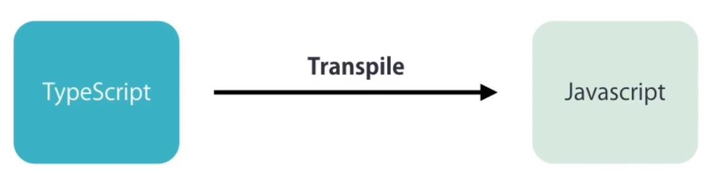

# TypeScript

## TS Überblick

Übermenge von JavaScript
Streng typisiert
Compiletime-Errors
Objektorientiert
Gute Toolunterstützung

---

## Edit – Build - Run

Codieren in TS
Compilieren (transpile) in JS ES5 oder JS ES6
Ausführen im Browser
Debuggen auf Basis von TS

---

## Simples TS-Program

Definition einer einfachen Funktion
Aufruf im „Hauptprogramm“

---

## Build and run

---

## Transpiliertes js-Programm

Ident ➔ gültiger JS-Code ist auch gültiger TS-Code

---

## Gültigkeitsbereich var

var (JS ES5) ➔ Innerhalb der Funktion

---

## Gültigkeitsbereich let

let (JS ES6) ➔ Blockorientiert
Erkennt Compilerfehler
Compiliert aber in gleiche JS-Datei wie vorher

---

## Variablendeklarationen

Explizite Typangabe oder Typinferenz

---

## Typsicherheit

---

## Aufzählungen enum

- Erzeugter JS-Code

---

## Typ herleitbar ➔ Intellisense

Sonst: Typeassertion (C# Cast)
Auch mit <> möglich

---

## Übung Types

Typsicherheit ausprobieren
string, number, boolean, any

---

## Arrays

---

## Tuple

---

## Beispiel PupilCounter

---

## Functions

Ähnlich wie in C# und Java
Typdefinition optional

---

## Funktionen sind normale Elemente

- In Variablen speicherbar
- Als Parameter übergebbar

---

## Beispiel: Summe mit automatischem parse

---

## Optionale Parameter

Überprüfen mit undefined

---

## Komfort wie in C#

- Funktionen als Parameter übergeben
- LambdaExpressions heißen ArrowFunctions

---

## Klassen

- Fields
- Functions in Klassen sind Methoden
- Standard public

---

## Klassen - Verwendung

Fields werden später in Properties eingepackt

---

## Wie viele Jahre ist der Schüler alt?

Gewünschte Ausgabe des Programms

---

## Alternativ im Browser

---

## Constructor, optionale Parameter

- Constructor wir in C#/Java
- Optionale Parameter am Schluss der Parameterliste

---

## Kapselung der fields

Get/Set-Methode wie in Java

---

## Definition der fields im Constructor

Sehr kompakter Code

---

## Properties in TS

- Kapselung in Getter/Setter wie in C#
- Validierung, Converter, …
- Intuitive Verwendung

---

## Compiler liefert Fehlermeldung

- AccessModifiers gibt es erst ab ES5 (können alle relevanten Browser)
- tsc compiliert per default gegen ES3
- Compiler konfigurieren (Target ES5)

---

## TS-Modul (nicht Angular Module)

Klasse in eigene Datei und „export“

---

## Verwendung über import

---

## Vererbung ist natürlich auch möglich

---
